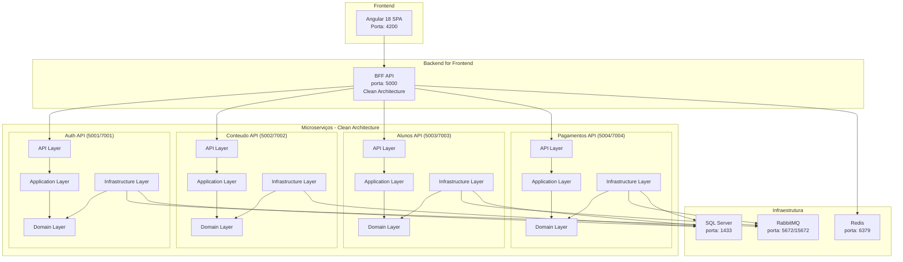

# 🎓 Plataforma Educacional Distribuída

Uma plataforma educacional moderna baseada em arquitetura de **microserviços**, desenvolvida com **.NET 8**, **Angular 18**, **RabbitMQ**, **SQL Server** e **Redis**, totalmente containerizada com **Docker**.


## 📋 Índice

- [Arquitetura do Sistema](#-arquitetura-do-sistema)
- [Pré-requisitos](#-pré-requisitos)
- [Execução Rápida](#-execução-rápida)
- [Microserviços](#-microserviços)
- [Infraestrutura](#-infraestrutura)
- [URLs de Acesso](#-urls-de-acesso)
- [Desenvolvimento](#-desenvolvimento)
- [Monitoramento](#-monitoramento)
- [Solução de Problemas](#-solução-de-problemas)
- [Contribuição](#-contribuição)

## 🏗️ Arquitetura do Sistema

### Visão Geral

A plataforma é composta por **5 microserviços independentes** + **1 BFF** + **1 Frontend**, cada um com seu próprio banco de dados e responsabilidades específicas:



### Princípios Arquiteturais

- ✅ **Database per Service**: Cada microserviço tem seu próprio banco
- ✅ **Event-Driven Architecture**: Comunicação assíncrona via RabbitMQ
- ✅ **API Gateway Pattern**: BFF centraliza comunicação com frontend
- ✅ **Circuit Breaker**: Resiliência com Polly
- ✅ **Health Checks**: Monitoramento de saúde dos serviços
- ✅ **JWT Authentication**: Autenticação centralizada
- ✅ **Clean Architecture**: DDD, SOLID, CQRS

### Estrutura Clean Architecture por Microserviço

Cada microserviço segue a **Clean Architecture** com as seguintes camadas:

#### 📁 **API Layer** (Controllers, Middleware)
- Controllers REST
- Middleware de autenticação
- Configuração de Swagger
- Validação de entrada

#### 📁 **Application Layer** (Use Cases, Services)
- DTOs de entrada/saída
- Interfaces de serviços
- Handlers de comandos/queries (CQRS)
- Validação de negócio

#### 📁 **Domain Layer** (Entities, Value Objects)
- Entidades de domínio
- Value Objects
- Interfaces de repositórios
- Eventos de domínio
- Regras de negócio

#### 📁 **Infrastructure Layer** (Data, External Services)
- Implementação de repositórios
- Contexto do Entity Framework
- Integração com RabbitMQ
- Configurações de banco de dados

## 🤔 Por que Scripts Auxiliares?

### ✅ **Scripts PowerShell**
- ✅ Ordem correta de inicialização 
- ✅ Configuração automática do RabbitMQ
- ✅ Verificações de saúde dos Serviços
- ✅ Mensagens informativas
- ✅ Tratamento de erros

### 📋 **Opções Disponíveis**
1. **PowerShell (.ps1)** - Automação completa
2. **Docker Compose puro** - Manual, requer configuração do RabbitMQ

## 🚀 Pré-requisitos

### Obrigatórios
- **Docker** >= 20.10
- **Docker Compose** >= 2.0
- **Git**

### Para Desenvolvimento
- **.NET SDK 8.0**
- **Node.js 18+** (para Angular)
- **Visual Studio 2022** ou **VS Code**

### Verificação da Instalação
```bash
# Verificar Docker
docker --version
docker-compose --version

# Verificar Git
git --version

# (Opcional) Verificar .NET
dotnet --version

# (Opcional) Verificar Node.js
node --version
npm --version
```

## ⚡ Execução Rápida

### 1. Clonar o Repositório
```bash
git clone https://github.com/jasonamaral/mba.modulo4.git
cd mba.modulo4
```

### 2. Executar o Sistema Completo

**PowerShell (Windows - Recomendado):**
```powershell
# Script completo com configuração automática do RabbitMQ
# Pode ser executado da raiz ou da pasta scripts
.\scripts\start-all.ps1

# Ou se estiver na pasta scripts:
cd scripts
.\start-all.ps1
```

**Manual (Docker Compose apenas):**
```powershell
# Iniciar infraestrutura
docker-compose up -d rabbitmq sqlserver redis

# Aguardar inicialização (aguarde ~2 minutos)
Start-Sleep -Seconds 120

# Iniciar microserviços
docker-compose up -d auth-api conteudo-api alunos-api pagamentos-api

# Aguardar APIs (aguarde ~1 minuto)
Start-Sleep -Seconds 60

# Iniciar BFF e Frontend
docker-compose up -d bff-api frontend

# ⚠️ IMPORTANTE: Configurar filas RabbitMQ manualmente em http://localhost:15672
```

### 3. Acessar a Aplicação

Após ~5 minutos de inicialização:

- **🌐 Frontend**: http://localhost:4200
- **📊 RabbitMQ Management**: http://localhost:15672 (admin/admin123)

## 🔧 Microserviços

### Auth API (porta 5001/7001)
**Responsabilidade**: Autenticação e autorização
- ✅ Cadastro e login de usuários
- ✅ Emissão e validação de tokens JWT
- ✅ Gerenciamento de roles (Admin/Aluno)
- ✅ Refresh tokens
- 📁 **Estrutura**: API → Application → Domain → Infrastructure
- 📊 **Swagger**: https://localhost:5001/swagger

### Conteudo API (porta 5002/7002)
**Responsabilidade**: Gestão de conteúdo educacional
- ✅ CRUD de cursos
- ✅ CRUD de aulas
- ✅ Gerenciamento de materiais didáticos
- ✅ Estrutura curricular
- 📁 **Estrutura**: API → Application → Domain → Infrastructure
- 📊 **Swagger**: https://localhost:5002/swagger

### Alunos API (porta 5003/7003)
**Responsabilidade**: Jornada do aluno
- ✅ Sistema de matrículas
- ✅ Tracking de progresso
- ✅ Geração de certificados
- ✅ Histórico acadêmico
- ✅ Consumo de eventos de pagamento
- 📁 **Estrutura**: API → Application → Domain → Infrastructure
- 📊 **Swagger**: https://localhost:5003/swagger

### Pagamentos API (porta 5004/7004)
**Responsabilidade**: Processamento financeiro
- ✅ Processamento de pagamentos
- ✅ Consulta de status
- ✅ Webhooks de confirmação
- ✅ Emissão de eventos
- ✅ Histórico de transações
- 📁 **Estrutura**: API → Application → Domain → Infrastructure
- 📊 **Swagger**: https://localhost:5004/swagger

### BFF API (porta 5000)
**Responsabilidade**: Backend for Frontend
- ✅ Orquestração de chamadas
- ✅ Agregação de dados
- ✅ Cache distribuído (Redis)
- ✅ Rate limiting
- ✅ Circuit breaker
- 📁 **Estrutura**: API → Application → Domain → Infrastructure
- 📊 **Swagger**: http://localhost:5000/swagger

## 🏗️ Infraestrutura

### RabbitMQ
- **Management UI**: http://localhost:15672
- **Credenciais**: admin/admin123
- **Filas configuradas**:
  - `pagamento-confirmado`
  - `matricula-realizada`
  - `certificado-gerado`
  - `usuario-registrado`
  - `curso-finalizado`

### SQL Server
- **Host**: localhost:1433
- **Usuário**: sa
- **Senha**: PlataformaEducacional123!
- **Bancos criados automaticamente**:
  - AuthDB
  - ConteudoDB
  - AlunosDB
  - PagamentosDB

### Redis
- **Host**: localhost:6379
- **Uso**: Cache distribuído para BFF

## 🌐 URLs de Acesso

### Aplicação
| Serviço | URL | Descrição |
|---------|-----|-----------|
| 📱 **Frontend** | http://localhost:4200 | Interface do usuário |
| 🔗 **BFF API** | http://localhost:5000 | Gateway para frontend |

### APIs (Swagger)
| API | HTTPS | HTTP | Descrição |
|-----|-------|------|-----------|
| 🔐 **Auth** | https://localhost:5001 | http://localhost:7001 | Autenticação |
| 📚 **Conteudo** | https://localhost:5002 | http://localhost:7002 | Cursos e aulas |
| 🎓 **Alunos** | https://localhost:5003 | http://localhost:7003 | Matrículas |
| 💳 **Pagamentos** | https://localhost:5004 | http://localhost:7004 | Transações |

### Infraestrutura
| Serviço | URL | Credenciais |
|---------|-----|-------------|
| 🐰 **RabbitMQ** | http://localhost:15672 | admin/admin123 |
| 🗄️ **SQL Server** | localhost:1433 | sa/PlataformaEducacional123! |
| 🔴 **Redis** | localhost:6379 | (sem senha) |

## 🛠️ Desenvolvimento

### Modo Desenvolvimento (Apenas Infraestrutura)
```powershell
# Iniciar apenas RabbitMQ, SQL Server e Redis
.\scripts\dev-mode.ps1
```

### Executar APIs Localmente
```powershell
# Auth API
cd src\backend\auth-api
dotnet run

# Conteudo API
cd src\backend\conteudo-api
dotnet run

# Alunos API
cd src\backend\alunos-api
dotnet run

# Pagamentos API
cd src\backend\pagamentos-api
dotnet run

# BFF API
cd src\backend\bff-api
dotnet run
```

### Executar Frontend Localmente
```powershell
cd src\frontend
npm install
npm start
```

### Rebuild de um Serviço
```bash
# Rebuild específico
docker-compose build [service-name]
docker-compose up -d [service-name]

# Exemplo: rebuild do Auth API
docker-compose build auth-api
docker-compose up -d auth-api
```

## 📊 Monitoramento

### Verificar Status do Sistema
```powershell
.\scripts\status.ps1
```

### Logs dos Serviços
```bash
# Ver todos os logs
docker-compose logs -f

# Ver logs de um serviço específico
docker-compose logs -f auth-api
docker-compose logs -f frontend
docker-compose logs -f rabbitmq
```

### Health Checks
Todos os serviços possuem endpoints de health check:
- Auth API: http://localhost:7001/health
- Conteudo API: http://localhost:7002/health
- Alunos API: http://localhost:7003/health
- Pagamentos API: http://localhost:7004/health
- BFF API: http://localhost:5000/health

### Monitorar Recursos
```bash
# Ver uso de CPU e memória
docker stats

# Ver apenas containers da plataforma
docker stats --format "table {{.Name}}\t{{.CPUPerc}}\t{{.MemUsage}}\t{{.NetIO}}"
```

## 🛑 Controle do Sistema

### Parar Sistema
```powershell
# Parar todos os serviços
.\scripts\stop-all.ps1

# Ou usando docker-compose
docker-compose down
```

### Parar e Limpar Tudo (incluindo volumes)
```bash
# ⚠️ CUIDADO: Remove dados do banco
docker-compose down -v
docker system prune -f
```

### Reiniciar um Serviço
```bash
docker-compose restart [service-name]

# Exemplo
docker-compose restart auth-api
```

## 🔧 Solução de Problemas

### Problema: Containers não iniciam
**Solução:**
```bash
# Verificar se as portas estão ocupadas
netstat -tulpn | grep -E '(4200|5000|5001|5002|5003|5004|1433|5672|15672|6379)'

# Parar containers conflitantes
docker-compose down
docker container prune -f

# Reiniciar
./scripts/start-all.sh
```

### Problema: Erro de conexão com banco
**Solução:**
```bash
# Verificar se SQL Server está rodando
docker-compose logs sqlserver

# Reiniciar SQL Server
docker-compose restart sqlserver

# Aguardar 60 segundos e reiniciar APIs
sleep 60
docker-compose restart auth-api conteudo-api alunos-api pagamentos-api
```

### Problema: Frontend não carrega
**Solução:**
```bash
# Verificar logs do frontend
docker-compose logs frontend

# Verificar se BFF está rodando
curl http://localhost:5000/health

# Rebuild do frontend
docker-compose build frontend
docker-compose up -d frontend
```

### Problema: RabbitMQ não conecta
**Solução:**
```bash
# Verificar RabbitMQ
docker-compose logs rabbitmq

# Reconfigurar filas
./scripts/setup-rabbitmq.sh

# Reiniciar serviços que usam RabbitMQ
docker-compose restart auth-api alunos-api pagamentos-api
```

### Problema: Erro de certificado SSL
**Solução:**
```bash
# Aceitar certificados auto-assinados no navegador
# Ou usar URLs HTTP:
# http://localhost:7001/swagger (Auth API)
# http://localhost:7002/swagger (Conteudo API)
# http://localhost:7003/swagger (Alunos API)
# http://localhost:7004/swagger (Pagamentos API)
```

## 📈 Performance e Escalabilidade

### Configurações de Produção
```bash
# Configurar para produção
export ASPNETCORE_ENVIRONMENT=Production

# Escalar serviços
docker-compose up -d --scale auth-api=2 --scale alunos-api=2
```

### Monitoramento de Recursos
```bash
# Ver uso detalhado
docker stats --format "table {{.Name}}\t{{.CPUPerc}}\t{{.MemUsage}}\t{{.MemPerc}}\t{{.NetIO}}\t{{.BlockIO}}"
```

## 🔒 Segurança

### Configurações de Segurança
- ✅ JWT com chave secreta forte
- ✅ Certificados SSL auto-assinados
- ✅ Segregação de rede Docker
- ✅ Health checks com timeout
- ✅ Conexões com TrustServerCertificate

### Para Produção (NÃO usar em produção real)
As configurações atuais são para **desenvolvimento/demonstração**:
- Senhas em texto claro
- Certificados auto-assinados
- Configurações de desenvolvimento

## 🤝 Contribuição

### Estrutura do Projeto
```
mba.modulo4/
├── src/backend/          # Microserviços .NET
│   ├── auth-api/         # Auth.API.sln
│   │   ├── src/
│   │   │   ├── Auth.API/           # API Layer
│   │   │   ├── Auth.Application/   # Application Layer
│   │   │   ├── Auth.Domain/        # Domain Layer
│   │   │   └── Auth.Infrastructure/# Infrastructure Layer
│   │   └── tests/
│   ├── alunos-api/       # Alunos.API.sln
│   │   ├── src/
│   │   │   ├── Alunos.API/
│   │   │   ├── Alunos.Application/
│   │   │   ├── Alunos.Domain/
│   │   │   └── Alunos.Infrastructure/
│   │   └── tests/
│   ├── conteudo-api/     # Conteudo.API.sln
│   │   ├── src/
│   │   │   ├── Conteudo.API/
│   │   │   ├── Conteudo.Application/
│   │   │   ├── Conteudo.Domain/
│   │   │   └── Conteudo.Infrastructure/
│   │   └── tests/
│   ├── pagamentos-api/   # Pagamentos.API.sln
│   │   ├── src/
│   │   │   ├── Pagamentos.API/
│   │   │   ├── Pagamentos.Application/
│   │   │   ├── Pagamentos.Domain/
│   │   │   └── Pagamentos.Infrastructure/
│   │   └── tests/
│   └── bff-api/          # BFF.API.sln
│       ├── src/
│       │   ├── BFF.API/
│       │   ├── BFF.Application/
│       │   ├── BFF.Domain/
│       │   └── BFF.Infrastructure/
│       └── tests/
├── src/frontend/         # Angular 18 SPA
├── scripts/              # Scripts de automação
├── config/               # Configurações
├── docker-compose.yml    # Orquestração Docker
└── README.md            # Este arquivo
```

### Convenções
- Usar **Clean Architecture** em todos os microserviços
- Seguir princípios **SOLID** e **DDD**
- Implementar **health checks** em novas APIs
- Documentar com **Swagger/OpenAPI**
- Usar **async/await** para operações I/O

### Padrões de Projeto Implementados

#### 🏗️ **Clean Architecture**
- **Dependency Inversion**: Camadas internas não dependem de camadas externas
- **Separation of Concerns**: Cada camada tem responsabilidade específica
- **Testability**: Fácil mock e teste unitário

#### 📋 **CQRS (Command Query Responsibility Segregation)**
- **Commands**: Operações que modificam estado
- **Queries**: Operações que apenas consultam dados
- **Handlers**: Processamento específico para cada comando/query

#### 🎯 **Domain-Driven Design (DDD)**
- **Entities**: Objetos com identidade única
- **Value Objects**: Objetos imutáveis sem identidade
- **Aggregates**: Conjuntos de entidades relacionadas
- **Domain Events**: Eventos que representam mudanças no domínio

#### 🔄 **Repository Pattern**
- **Interfaces**: Definidas na camada de domínio
- **Implementações**: Na camada de infraestrutura
- **Abstração**: Desacoplamento entre domínio e dados

#### 📡 **Event-Driven Architecture**
- **RabbitMQ**: Message broker para comunicação assíncrona
- **Domain Events**: Eventos de domínio publicados
- **Event Handlers**: Processamento de eventos

## 📚 Documentação Adicional

- [Arquitetura de Microserviços](docs/arquitetura-microsservicos.md)
- [Diagrama de Banco de Dados](docs/diagrama-banco-dados.md)
- [Guia de Desenvolvimento](docs/desenvolvimento-passo-a-passo.md)

## 📝 Licença

Este projeto é para fins educacionais (MBA DevXpert - Módulo 4).

---

## ✅ Quick Start Checklist

- [ ] Docker Desktop instalado e rodando
- [ ] Repositório clonado
- [ ] Executar `.\scripts\start-all.ps1`
- [ ] Aguardar ~5 minutos
- [ ] Acessar http://localhost:4200
- [ ] Verificar http://localhost:15672 (RabbitMQ)
- [ ] Testar APIs via Swagger

**🎉 Se chegou até aqui, sua Plataforma Educacional está rodando!**

---

**Desenvolvido com ❤️ para o MBA DevXpert - Módulo 4** 