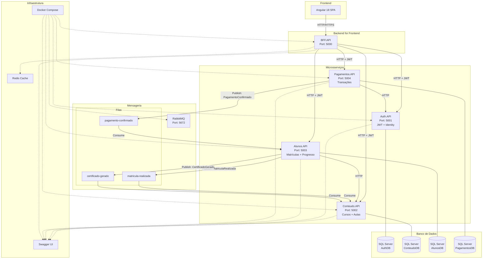
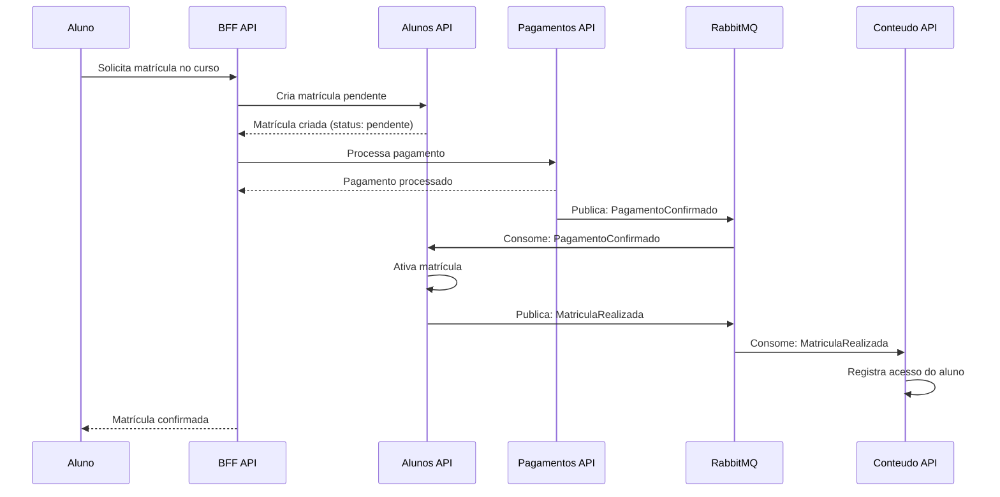
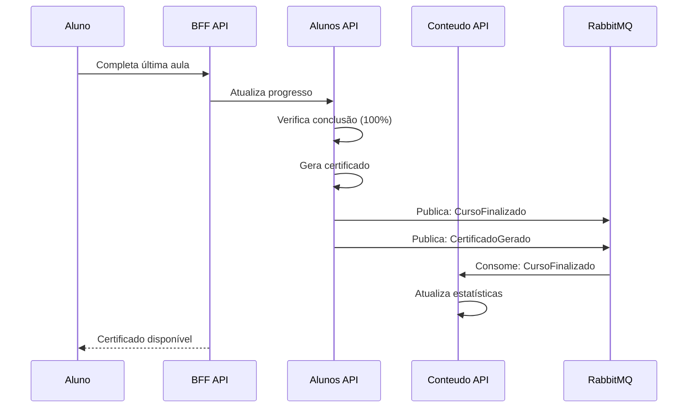

# Arquitetura de Microsserviços - Plataforma Educacional

## Visão Geral da Arquitetura

A plataforma educacional foi projetada seguindo os princípios de arquitetura de microsserviços, onde cada serviço é independente, possui seu próprio banco de dados e se comunica através de APIs REST e mensageria assíncrona.

## Diagrama de Arquitetura



## Bounded Contexts e Responsabilidades

### Auth API (Porto 5001)
**Contexto**: Autenticação e Autorização
**Responsabilidades**:
- Cadastro e gerenciamento de usuários
- Autenticação via ASP.NET Core Identity
- Emissão e validação de tokens JWT
- Refresh tokens
- Controle de acesso baseado em roles (Admin/Aluno)

**Banco de Dados**: AuthDB (independente)
- Tabelas: Users, Roles, UserRoles, UserClaims
- **Deployment**: Containerizado independentemente
- **Eventos**: Publica eventos de autenticação via RabbitMQ

### Conteudo API (Porto 5002)
**Contexto**: Gestão de Conteúdo Educacional
**Responsabilidades**:
- Gerenciamento de cursos
- Gerenciamento de aulas
- Conteúdo programático
- Materiais didáticos
- Estrutura curricular

**Banco de Dados**: ConteudoDB (independente)
- Tabelas: Cursos, Aulas, Materiais, ConteudoProgramatico
- **Deployment**: Containerizado independentemente
- **Eventos**: Consome eventos de matrícula via RabbitMQ

### Alunos API (Porto 5003)
**Contexto**: Jornada do Aluno
**Responsabilidades**:
- Gestão de matrículas
- Tracking de progresso
- Geração de certificados
- Histórico acadêmico
- Consumo de eventos de pagamento

**Banco de Dados**: AlunosDB (independente)
- Tabelas: Matriculas, Progresso, Certificados, HistoricoAluno
- **Deployment**: Containerizado independentemente
- **Eventos**: Consome eventos de pagamento, publica eventos de matrícula

### Pagamentos API (Porto 5004)
**Contexto**: Processamento Financeiro
**Responsabilidades**:
- Processamento de pagamentos
- Consulta de status de transações
- Integração com gateways de pagamento
- Emissão de eventos de pagamento
- Histórico de transações

**Banco de Dados**: PagamentosDB (independente)
- Tabelas: Pagamentos, Transacoes, StatusPagamento
- **Deployment**: Containerizado independentemente
- **Eventos**: Publica eventos de pagamento via RabbitMQ

### BFF API (Porto 5000)
**Contexto**: Orquestração Frontend
**Responsabilidades**:
- Agregação de dados de múltiplas APIs
- Orquestração de fluxos complexos
- Cache distribuído
- Rate limiting
- Resiliência (Circuit Breaker, Retry)

**Banco de Dados**: Sem banco próprio (stateless)
- **Deployment**: Containerizado independentemente
- **Cache**: Redis para cache distribuído

## Padrões de Comunicação

### Comunicação Síncrona (HTTP)
- **Frontend ↔ BFF**: Todas as requisições do frontend passam pelo BFF
- **BFF ↔ APIs**: BFF comunica com todas as APIs via HTTP
- **APIs ↔ APIs**: Comunicação direta quando necessário (ex: validações)

### Comunicação Assíncrona (Eventos)
- **RabbitMQ**: Message broker para eventos de domínio
- **Padrão Pub/Sub**: Publishers emitem eventos, consumers processam
- **Idempotência**: Garante que processar o mesmo evento múltiplas vezes não cause problemas

## Eventos de Domínio

### PagamentoConfirmado
```json
{
  "eventId": "guid",
  "timestamp": "2024-01-01T10:00:00Z",
  "eventType": "PagamentoConfirmado",
  "data": {
    "matriculaId": "guid",
    "valorPago": 299.99,
    "dataPagamento": "2024-01-01T10:00:00Z",
    "metodoPagamento": "CartaoCredito"
  }
}
```

### PagamentoRejeitado
```json
{
  "eventId": "guid",
  "timestamp": "2024-01-01T10:00:00Z",
  "eventType": "PagamentoRejeitado",
  "data": {
    "matriculaId": "guid",
    "motivoRejeicao": "Cartão sem limite",
    "dataTentativa": "2024-01-01T10:00:00Z"
  }
}
```

### MatriculaRealizada
```json
{
  "eventId": "guid",
  "timestamp": "2024-01-01T10:00:00Z",
  "eventType": "MatriculaRealizada",
  "data": {
    "alunoId": "guid",
    "cursoId": "guid",
    "dataMatricula": "2024-01-01T10:00:00Z",
    "valorPago": 299.99
  }
}
```

### CursoFinalizado
```json
{
  "eventId": "guid",
  "timestamp": "2024-01-01T10:00:00Z",
  "eventType": "CursoFinalizado",
  "data": {
    "alunoId": "guid",
    "cursoId": "guid",
    "dataFinalizacao": "2024-01-01T10:00:00Z",
    "percentualConclusao": 100
  }
}
```

### CertificadoGerado
```json
{
  "eventId": "guid",
  "timestamp": "2024-01-01T10:00:00Z",
  "eventType": "CertificadoGerado",
  "data": {
    "alunoId": "guid",
    "cursoId": "guid",
    "certificadoId": "guid",
    "dataEmissao": "2024-01-01T10:00:00Z"
  }
}
```

## Fluxos de Negócio

### Fluxo: Matrícula com Pagamento


### Fluxo: Conclusão de Curso


## Segurança

### Autenticação JWT
- **Emissor**: Auth API
- **Validação**: Middleware em todas as APIs
- **Claims**: UserId, Role, Email, Permissions
- **Expiração**: Access token (15 min), Refresh token (7 dias)

### Autorização
- **Roles**: Admin, Aluno
- **Policies**: Baseadas em claims e contexto
- **Scopes**: Por API e operação

### HTTPS/TLS
- **Comunicação**: Todas as comunicações externas via HTTPS
- **Certificados**: Auto-assinados para desenvolvimento
- **CORS**: Configurado no BFF para o frontend

## Resiliência e Confiabilidade

### Padrões Implementados (Polly)
- **Retry**: Tentativas automáticas em falhas temporárias
- **Circuit Breaker**: Interrupção de chamadas para serviços instáveis
- **Timeout**: Limite de tempo para operações
- **Bulkhead**: Isolamento de recursos críticos

### Monitoramento
- **Health Checks**: Endpoints de saúde em todas as APIs
- **Logs Estruturados**: Serilog com contexto de requisição
- **Métricas**: Contadores de requisições, latência, erros
- **Distributed Tracing**: Correlação de requisições entre serviços

## Estratégia de Dados

### Database per Service
- **Isolamento**: Cada serviço possui seu próprio banco
- **Autonomia**: Mudanças no schema não afetam outros serviços
- **Tecnologia**: Flexibilidade para escolher diferentes SGBDs

### Consistência Eventual
- **Eventos**: Propagação de mudanças via mensageria
- **Idempotência**: Operações podem ser repetidas sem efeitos colaterais
- **Compensação**: Rollback através de eventos compensatórios

## Deployment e Infraestrutura

### Containerização
- **Docker**: Cada API em container independente
- **Docker Compose**: Orquestração local
- **Multi-stage builds**: Otimização das imagens

### Configuração
- **Environment Variables**: Configuração por ambiente
- **Secrets**: Strings de conexão e chaves via Docker secrets
- **Feature Flags**: Controle de funcionalidades por configuração

### Observabilidade
- **Logs**: Centralizados via ELK Stack (futuro)
- **Métricas**: Prometheus + Grafana (futuro)
- **Tracing**: Jaeger (futuro)

## Performance e Escalabilidade

### Caching
- **Redis**: Cache distribuído no BFF
- **In-Memory**: Cache local para dados estáticos
- **CDN**: Assets estáticos do frontend

### Load Balancing
- **Nginx**: Proxy reverso (futuro)
- **Round Robin**: Distribuição de carga
- **Health Checks**: Remoção de instâncias não saudáveis

### Otimizações
- **Connection Pooling**: Reutilização de conexões DB
- **Async/Await**: Operações não bloqueantes
- **Pagination**: Limitação de resultados de consultas

## Considerações de Desenvolvimento

### Princípios Aplicados
- **SOLID**: Princípios de design de software
- **DDD**: Domain-Driven Design
- **Clean Code**: Código limpo e legível
- **CQRS**: Separação de comandos e consultas (futuro)

### Testes
- **Unitários**: Cobertura > 80%
- **Integração**: Testes entre serviços
- **Contrato**: Pact testing
- **End-to-End**: Fluxos completos

### Versionamento
- **API Versioning**: Versionamento de APIs
- **Backward Compatibility**: Compatibilidade com versões anteriores
- **Feature Flags**: Ativação gradual de funcionalidades

---

Esta arquitetura garante escalabilidade, manutenibilidade e resiliência, seguindo as melhores práticas de microsserviços e permitindo evolução independente de cada contexto de negócio. 