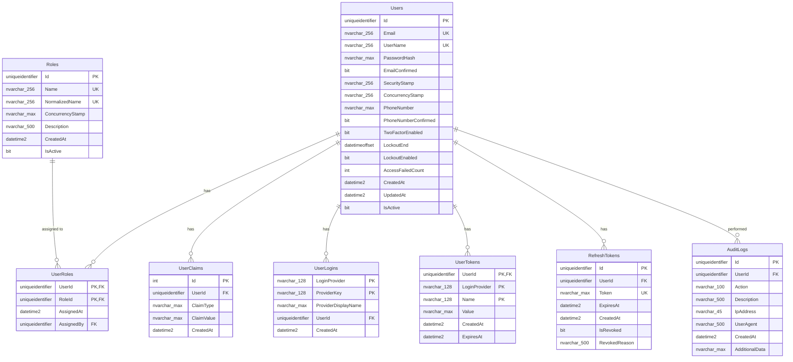

# Diagrama de Banco de Dados - Microsserviços Independentes

## Visão Geral da Arquitetura de Dados

Cada microsserviço possui seu próprio banco de dados isolado, seguindo o padrão **Database per Service**. A sincronização entre bancos acontece através de eventos assíncronos via RabbitMQ.

## Diagrama Geral dos Bancos de Dados


## AuthDB - Banco de Dados de Autenticação



## ConteudoDB - Banco de Dados de Conteúdo


## AlunosDB - Banco de Dados de Alunos


## PagamentosDB - Banco de Dados de Pagamentos


## Cache Distribuído (Redis) - BFF API

```mermaid
graph TB
    subgraph "Redis Cache - BFF API"
        Cache[Redis Cache]
        
        subgraph "Cached Data"
            UserSessions[User Sessions<br/>jwt:user:{userId}]
            ApiResponses[API Responses<br/>api:response:{hash}]
            UserProfiles[User Profiles<br/>user:profile:{userId}]
            CursoDetails[Curso Details<br/>curso:details:{cursoId}]
            DashboardData[Dashboard Data<br/>dashboard:{userId}]
        end
        
        Cache --> UserSessions
        Cache --> ApiResponses
        Cache --> UserProfiles
        Cache --> CursoDetails
        Cache --> DashboardData
    end
    
    subgraph "TTL Configuration"
        TTL1[User Sessions: 30 min]
        TTL2[API Responses: 5 min]
        TTL3[User Profiles: 1 hour]
        TTL4[Curso Details: 15 min]
        TTL5[Dashboard Data: 10 min]
    end
```

## Fluxo de Dados Entre Bancos via Eventos


## Sincronização de Dados de Referência


## Considerações de Consistência

### Consistência Eventual
- **Princípio**: Dados podem ficar temporariamente inconsistentes
- **Solução**: Eventos assíncronos garantem sincronização eventual
- **Monitoramento**: Logs de eventos para rastreamento

### Transações Distribuídas
- **Problema**: Não há ACID entre bancos diferentes
- **Solução**: Saga Pattern para transações distribuídas
- **Compensação**: Eventos de rollback quando necessário

### Dados Duplicados
- **Princípio**: Duplicação intencional para independência
- **Exemplos**: UserId em todos os bancos
- **Sincronização**: Via eventos assíncronos

## Backup e Recuperação


## Monitoramento de Performance


---

Esta arquitetura de banco de dados garante:

✅ **Independência Completa**: Cada microsserviço tem seu próprio banco  
✅ **Escalabilidade Individual**: Pode escalar bancos independentemente  
✅ **Falhas Isoladas**: Falha em um banco não afeta outros  
✅ **Flexibilidade Tecnológica**: Cada banco pode usar tecnologia diferente  
✅ **Consistência Eventual**: Dados sincronizados via eventos  
✅ **Transações Distribuídas**: Saga pattern para fluxos complexos  

A estrutura segue as melhores práticas de microsserviços com **Database per Service Pattern**! 